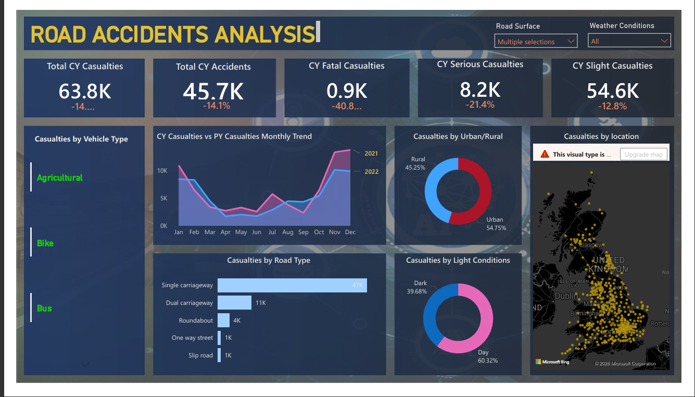

# 🚗 Road Accidents Analysis - Power BI Dashboard
## 🖼️ Dashboard Preview

## 📌 Overview
Analysis of UK Road Accidents data (2021-2022)
to identify patterns and trends in road safety.

## 📊 Key Insights
| Metric | Value | YoY Change |
|--------|-------|------------|
| Total CY Casualties | 63.8K | -14% |
| Total CY Accidents | 45.7K | -14.1% |
| Fatal Casualties | 0.9K | -40.8% |
| Serious Casualties | 8.2K | -21.4% |
| Slight Casualties | 54.6K | -12.8% |

## 🛠️ Tools Used
- **Power BI Desktop**
- **DAX** (Data Analysis Expressions)
- **Data Modeling**
- **Power Query**

## 📈 Dashboard Features
- Casualties by Vehicle Type
- CY vs PY Monthly Trend
- Casualties by Road Type
- Casualties by Light Conditions
- Casualties by Urban/Rural
- Casualties by Location (Map)

## 📁 Files in Repository
- `README.md` - Project Documentation
- `Road Accidents Analysis.pdf` - Dashboard PDF

## 🔗 Connect with Me
- GitHub: [vickey1505](https://github.com/vickey1505)
